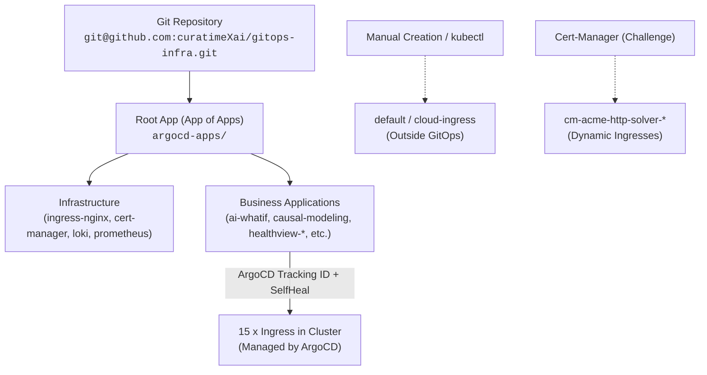

# GitOps & ArgoCD Audit: Applications, Ingress Management, and Resource Ownership

**Audit Date:** September 14, 2026  
**GitOps Controller:** ArgoCD (namespace: `argocd`)  
**Primary Manifest Repository:** `git@github.com:curatimeXai/gitops-infra.git`  
**Deployment Pattern:** App of Apps (Root application `root` → `argocd-apps/` → child applications in `apps/*`)  

---

## 1. GitOps Executive Summary

The audit confirmed that the cluster is almost entirely managed via GitOps using ArgoCD, with active policies for automated self-healing (`selfHeal: true`) and obsolete resource pruning (`prune: true`).

| Category | Value | Description |
| :--- | :--- | :--- |
| **Total ArgoCD Applications** | 27 applications | Infrastructure charts + business services |
| **Healthy & Synced** | 20 applications | Completely up-to-date and healthy (including `ai-whatif`) |
| **OutOfSync / Degraded** | 3 applications | `prometheus`, `gatewayapi-crds`, `root` (historical `ai-whatif` resolved) |
| **Progressing** | 4 applications | `healthmap-adaptatutor`, `healthview-segmentation3d`, `alloy`, `loki` |
| **Ingress under GitOps** | 15 of 18 | 15 managed by ArgoCD, 1 manual (`cloud-ingress`), 2 dynamic solvers |



> [!IMPORTANT]
> **Critical Rule for Applying Changes:**  
> Because applications have `selfHeal: true` enabled, any manual modifications to resources via `kubectl edit ingress` or `kubectl apply` will be **automatically overwritten by ArgoCD**.  
> All updates to domains, TLS annotations, and routing rules must be committed to the `git@github.com:curatimeXai/gitops-infra.git` repository under the respective `apps/<service-name>/` directories.

---

## 2. ArgoCD Applications Status

### Applications Summary Table

| Application (Name) | Namespace | Git Path | Revision | Target NS | Sync Status | Health Status | Auto-Sync (Prune/SelfHeal) |
| :--- | :--- | :--- | :---: | :--- | :---: | :---: | :---: |
| **ai-whatif** | `argocd` | `apps/ai-whatif` | HEAD | `ai-whatif` | Synced | 🟢 **Healthy** | prune: true, selfHeal: true |
| **alloy** | `argocd` | *(chart/custom)* | — | `monitoring` | Synced | 🟡 Progressing | prune: true, selfHeal: true |
| **causal-modeling** | `argocd` | `apps/causal-modeling` | HEAD | `causal-modeling` | Synced | 🟢 Healthy | prune: true, selfHeal: true |
| **cert-manager** | `argocd` | `charts.jetstack.io` (v1.20.2) | Helm | `cert-manager` | Synced | 🟢 Healthy | prune: true, selfHeal: true |
| **cilium-apigateway** | `argocd` | `apps/cilium-apiGateway` | HEAD | `gateway` | Synced | 🟢 Healthy | prune: true, selfHeal: true |
| **cluster-autoscaler** | `argocd` | `apps/cluster-autoscaler` | HEAD | `kube-system` | Synced | 🟢 Healthy | prune: true, selfHeal: true |
| **cluster-issuer** | `argocd` | `apps/cluster-issuer` | HEAD | `cert-manager` | Synced | 🟢 Healthy | prune: true, selfHeal: true |
| **ecgprediction** | `argocd` | `apps/healthview-ecgprediction` | HEAD | `ecgprediction` | Synced | 🟢 Healthy | prune: true, selfHeal: true |
| **gatewayapi-crds** | `argocd` | `apps/crds-gateway-api` | HEAD | `gateway` | ⚠️ OutOfSync | 🟢 Healthy | Manual |
| **healthmap-adaptatutor** | `argocd` | `apps/healthmap-adaptatutor` | HEAD | `healthmap-adaptatutor` | Synced | 🟡 **Progressing** | prune: true, selfHeal: true |
| **healthmap-heart-sayings** | `argocd` | `apps/healthmap-heart-sayings` | HEAD | `healthmap-heart-sayings` | Synced | 🟢 Healthy | prune: true, selfHeal: true |
| **healthmap-pollutionmap** | `argocd` | `apps/healthmap-pollutionmap` | HEAD | `pollutionmap` | Synced | 🟢 Healthy | prune: true, selfHeal: true |
| **healthmap-worldhealthmap** | `argocd` | `apps/healthmap-worldhealthmap` | HEAD | `worldhealthmap` | Synced | 🟢 Healthy | prune: true, selfHeal: true |
| **healthview-cardiomegaly-cnn** | `argocd` | `apps/healthview-cardiomegaly-cnn` | HEAD | `healthview-cardiomegaly-cnn` | Synced | 🟢 Healthy | prune: true, selfHeal: true |
| **healthview-echoexplore** | `argocd` | `apps/healthview-echoexplore` | HEAD | `healthview-echoexplore` | Synced | 🟢 Healthy | prune: true, selfHeal: true |
| **healthview-echogame** | `argocd` | `apps/healthview-echogame` | HEAD | `healthview-echogame` | Synced | 🟢 Healthy | prune: true, selfHeal: true |
| **healthview-segmentation3d** | `argocd` | `apps/healthview-segmentation3d` | HEAD | `healthview-segmentation3d` | Synced | 🟡 Progressing | prune: true, selfHeal: true |
| **healthview-surgicsense** | `argocd` | `apps/healthview-surgicsense` | HEAD | `healthview-surgicsense` | Synced | 🟢 Healthy | prune: true, selfHeal: true |
| **ingress-nginx** | `argocd` | Helm (v4.15.1) | Helm | `ingress-nginx` | Synced | 🟢 Healthy | prune: true, selfHeal: true |
| **loki** | `argocd` | *(monitoring)* | — | `monitoring` | Synced | 🟡 Progressing | prune: true, selfHeal: true |
| **metrics-server** | `argocd` | Helm (v3.13.1) | Helm | `kube-system` | Synced | 🟢 Healthy | prune: true, selfHeal: true |
| **nightingale-harmoniahealth** | `argocd` | `apps/nightingale-harmoniahealth` | HEAD | `nightingale-harmoniahealth` | Synced | 🟢 Healthy | prune: true, selfHeal: true |
| **nightingale-heartaware** | `argocd` | `apps/nightingale-heartaware` | master | `nightingale-heartaware` | Synced | 🟢 Healthy | prune: true, selfHeal: true |
| **nightingale-lifesaver** | `argocd` | `apps/nightingale-lifesaver` | HEAD | `nightingale-lifesaver` | Synced | 🟢 Healthy | prune: true, selfHeal: true |
| **prometheus** | `argocd` | *(monitoring)* | — | `monitoring` | ⚠️ OutOfSync | 🟢 Healthy | prune: true, selfHeal: true |
| **prometheus-operator** | `argocd` | `apps/prometheus-operator` | HEAD | `monitoring` | Synced | 🟢 Healthy | prune: true, selfHeal: true |
| **root** | `argocd` | `argocd-apps/` | HEAD | `argocd` | ⚠️ OutOfSync | 🟢 Healthy | prune: true, selfHeal: true |

---

## 3. Ingress Management Matrix (GitOps Tracking & Ownership)

The table below demonstrates which Ingress resources are actively managed by ArgoCD (with a tracking ID), which are dynamically generated by external controllers, and which exist outside GitOps:

| Namespace | Ingress Name | ArgoCD Tracking ID / Owner | Manager / Owner | In GitOps? |
| :--- | :--- | :--- | :--- | :---: |
| `ai-whatif` | `aiwhatif-ingress` | `ai-whatif:...:aiwhatif-ingress` | `argocd-controller` | ✅ YES |
| `causal-modeling` | `causal-modeling-ingress` | `causal-modeling:...:causal-modeling-ingress` | `argocd-controller` | ✅ YES |
| `default` | `cloud-ingress` | *(None)* | `kubectl` / Manual | ❌ **NO** |
| `ecgprediction` | `ecgprediction-ingress` | `ecgprediction:...:ecgprediction-ingress` | `argocd-controller` | ✅ YES |
| `healthmap-adaptatutor` | `cm-acme-http-solver-5p4md` | *(None)* | `cert-manager` (Owner: `Challenge`) | ⚙️ Dynamic |
| `healthmap-adaptatutor` | `cm-acme-http-solver-qsffv` | *(None)* | `cert-manager` (Owner: `Challenge`) | ⚙️ Dynamic |
| `healthmap-adaptatutor` | `healthmap-adaptatutor` | `healthmap-adaptatutor:...:healthmap-adaptatutor` | `argocd-controller` | ✅ YES |
| `healthmap-heart-sayings` | `healthmap-heart-sayings` | `healthmap-heart-sayings:...` | `argocd-controller` | ✅ YES |
| `healthview-cardiomegaly-cnn`| `cardiomegaly-ingress` | `healthview-cardiomegaly-cnn:...` | `argocd-controller` | ✅ YES |
| `healthview-echoexplore` | `echoexplore-ingress` | `healthview-echoexplore:...` | `argocd-controller` | ✅ YES |
| `healthview-echogame` | `echogame-ingress` | `healthview-echogame:...` | `argocd-controller` | ✅ YES |
| `healthview-segmentation3d` | `healthview-segmentation3d`| `healthview-segmentation3d:...` | `argocd-controller` | ✅ YES |
| `healthview-surgicsense` | `healthview-surgicsense` | `healthview-surgicsense:...` | `argocd-controller` | ✅ YES |
| `nightingale-harmoniahealth`| `harmoniahealth-ingress` | `nightingale-harmoniahealth:...` | `argocd-controller` | ✅ YES |
| `nightingale-heartaware` | `heartaware-ingress` | `nightingale-heartaware:...` | `argocd-controller` | ✅ YES |
| `nightingale-lifesaver` | `nightingale-lifesaver` | `nightingale-lifesaver:...` | `argocd-controller` | ✅ YES |
| `pollutionmap` | `pollutionmap-ingress` | `healthmap-pollutionmap:...` | `argocd-controller` | ✅ YES |
| `worldhealthmap` | `worldhealthmap-ingress` | `healthmap-worldhealthmap:...` | `argocd-controller` | ✅ YES |

---

## 4. Problematic Applications and Anomalies

### 1. `ai-whatif` (Historical: OutOfSync & Degraded → Resolved: Synced & Healthy)
* **Historical Finding:** `ai-whatif` was previously reported in `OutOfSync` and `Degraded` status. The audit identified an indentation error in `apps/ai-whatif/backendR-httpRoute.yaml` (`path: null`), which caused the Cilium Gateway controller to reject the route.
* **Final Resolution:** **Resolved: routes removed because NGINX became authoritative routing path**. Rather than fixing indentation in unused legacy routes, the entire legacy Cilium HTTPRoute layer was deleted from GitOps (`backendPy-httpRoute.yaml`, `backendR-httpRoute.yaml`, `frontend-httpRoute.yaml`) and pruned from the cluster by ArgoCD.
* **Current Final State:**
  ```text
  ArgoCD: Synced / Healthy
  HTTPRoute resources in ai-whatif: none
  ```
  All four endpoints (`aiwhatif.mlthrive.com`, `healthyheart.mlthrive.com`, `api.aiwhatif.mlthrive.com`, `api-python.aiwhatif.mlthrive.com`) route cleanly through `aiwhatif-ingress` via NGINX LB `212.147.228.214` with Let's Encrypt TLS certificate `aiwhatif-mlthrive-tls`.

### 2. `healthmap-adaptatutor` (Synced, but Progressing)
* **Root Cause:** The application was in `Progressing` status primarily because cert-manager was unable to complete TLS certificate issuance (`adaptatutor-tls` and `api-adaptatutor-tls` stuck in `False` for 75 days).
* **Impact:** Presence of temporary `cm-acme-http-solver-*` objects tied to stale ACME challenges.

### 3. `default/cloud-ingress` (Shadow Resource Outside GitOps)
* **Observation:** Lacks the `argocd.argoproj.io/tracking-id` annotation.
* Created either manually via `kubectl apply` or through a legacy bootstrap script.
* Intercepts all catch-all traffic (`*`) on port 80 routing to backend `cloud-web-service`.
* **Recommendation:** If permanently required, migrate this manifest into `gitops-infra` to eliminate configuration drift.

### 4. `root` (OutOfSync)
* Root application (App of Apps) tracking the `argocd-apps/` directory.
* `OutOfSync` status indicates that child application manifests were updated in Git without being applied, or parameter discrepancies exist with cluster CRDs.

---

## 5. Implications for Migration to `mlthrive.com`

1. **Single Source of Truth:**  
   All Ingress routing manifests for services are located under:
   ```text
   git@github.com:curatimeXai/gitops-infra.git
   ├── apps/
   │   ├── ai-whatif/
   │   ├── causal-modeling/
   │   ├── healthview-*/
   │   ├── nightingale-*/
   │   └── ...
   ```
2. **Safe Migration Practice:**  
   Attempting live edits via CLI (`kubectl edit ingress ...`) will trigger immediate rollback by ArgoCD's `selfHeal` mechanism.  
3. **Rollout Workflow for New Domains:**
   - Commit Ingress updates (`apps/<app>/ingress.yaml`) replacing or complementing `*.nightingaleheart.com` with `*.mlthrive.com`.
   - Push changes to Git and trigger ArgoCD sync.
