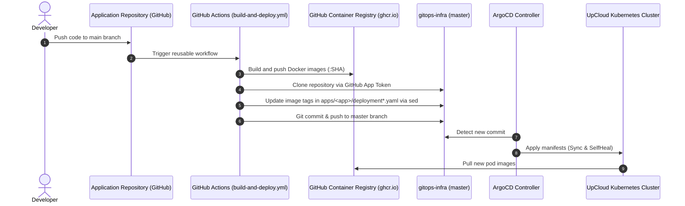

# Comprehensive Analysis of the `gitops-infra` Repository

**Repository:** `git@github.com:curatimeXai/gitops-infra.git`  
**Local Path:** `D:\Projects\Upcloud\gitops-infra`  
**Current Branch:** `master`  
**Target Platform:** UpCloud Managed Kubernetes (UKS)  
**Analysis Date:** September 14, 2026  

---

## 1. Purpose and Architecture of the Repository

The `gitops-infra` repository serves as the **Single Source of Truth** for managing the Kubernetes cluster in UpCloud. All infrastructure and applications are automatically deployed via **ArgoCD** following GitOps principles.

### Directory Structure
```text
gitops-infra/
├── .github/
│   └── workflows/
│       └── build-and-deploy.yml    # Reusable CI/CD workflow for build and auto-deployment
├── argocd-apps/                    # ArgoCD Application manifests (App of Apps pattern)
│   ├── ai-whatif.yaml
│   ├── causal-modeling.yaml
│   ├── ingress-nginx.yaml
│   ├── cert-manager.yaml
│   ├── values-alloy.yaml           # Helm values for monitoring
│   ├── values-loki.yaml
│   └── ... (29 files total)
├── apps/                           # K8s manifests for specific services and infrastructure
│   ├── ai-whatif/
│   ├── causal-modeling/
│   ├── cilium-apiGateway/          # Cilium Gateway API definitions
│   ├── cluster-issuer/             # Let's Encrypt cluster issuers (HTTP-01 and DNS-01)
│   ├── healthview-*/               # Medical ML services
│   ├── nightingale-*/              # Nightingale ecosystem services
│   └── ... (20 directories total)
├── root-app.yaml                   # ArgoCD Root Application (Bootstrap)
└── README.md                       # Quick guide for adding services
```

---

## 2. Delivery Model and CI/CD Pipeline

### Architectural Pattern: App of Apps
1. **Bootstrap (`root-app.yaml`):**
   - Applied once during cluster initialization.
   - The root application `root` monitors the `argocd-apps/` directory.
2. **Service Declaration (`argocd-apps/*.yaml`):**
   - Each service has its own `Application` manifest in the `argocd` namespace.
   - Automation policies are enabled:
     ```yaml
     syncPolicy:
       automated:
         prune: true      # Delete resources removed from Git
         selfHeal: true   # Automatically revert any manual kubectl modifications
     ```
3. **Target Manifests (`apps/<service-name>/`):**
   - Contains standard Kubernetes manifests: `namespace.yaml`, `deployment.yaml`, `service.yaml`, `ingress.yaml`, `network-policy.yaml`.



### Reusable Workflow (`.github/workflows/build-and-deploy.yml`)
- Accepts inputs: `app-name`, `frontend-image`, `backend-image`, `image`, `frontend-context`, `backend-context`, `api-url`.
- Authenticates using a **GitHub App Token** (`curatimeXai`) and pushes images to `ghcr.io/curatimexai/<image>:<sha>`.
- Automatically modifies manifests in `apps/<app-name>/deployment*.yaml` and pushes changes to `gitops-infra:master`.

---

## 3. Infrastructure Components Analysis

### Dual Parallel Load Balancers in UpCloud
Live cluster inspection revealed that **two independent UpCloud Managed Load Balancers** are provisioned:

| Load Balancer | IP / UpCloud LB Hostname | Served Services | Controller / Mechanism |
| :--- | :--- | :--- | :--- |
| **LB №1 (Ingress)** | `lb-0a9b1179d97749e8914609fb8f972856-1.upcloudlb.com` (`212.147.228.214`) | **15 production services** (`worldhealthmap`, `echogame`, `causal-modeling`, etc.) | NGINX Ingress Controller |
| **LB №2 (Gateway API)** | `lb-0a26cfb0d0f44bcf921ff7ba806f1739-1.upcloudlb.com` (`212.147.228.215`) | **Only `ai-whatif`** (3 HTTPRoutes) + `http-redirect` | Cilium Gateway API (`gatewayClassName: cilium`) |

### Infrastructure Components Summary Table

| Component | Type | Version / Source | Purpose |
| :--- | :--- | :--- | :--- |
| **Ingress NGINX** | Helm Chart | `4.15.1` (`kubernetes.github.io/ingress-nginx`) | Primary Ingress controller for incoming HTTP(S) traffic |
| **Cert-Manager** | Helm Chart | `v1.20.2` (`charts.jetstack.io`) | Automated SSL/TLS certificate management via Let's Encrypt |
| **Cilium Gateway API** | K8s Manifests | `apps/cilium-apiGateway` + `apps/crds-gateway-api` | Next-generation Gateway API (`gateway.networking.k8s.io/v1`). Active on LB №2 |
| **Metrics Server** | Helm Chart | `3.13.1` (`kubernetes-sigs.github.io/metrics-server`) | CPU/Memory metrics collection for HPA |
| **Cluster Autoscaler** | K8s Manifests | `apps/cluster-autoscaler` | Node autoscaling in UpCloud |
| **Loki** | Helm + S3 | `values-loki.yaml` | Centralized logging with backend in **UpCloud Object Storage** (`dl46g-private.upcloudobjects.com`) |
| **Grafana Alloy** | Helm Chart | `values-alloy.yaml` | Telemetry collector (OpenTelemetry / Prometheus) |
| **Prometheus Operator** | Helm Chart | `apps/prometheus-operator` + `values-prometheus.yaml` | Cluster monitoring and alerting |

---

## 4. In-Depth TLS & Cert-Manager Analysis

The repository contains two distinct certificate issuance mechanisms:

### 1. Global `ClusterIssuer`: `letsencrypt-prod`
* **File:** `apps/cluster-issuer/cluster-issuer.yaml`
* **Challenge Type:** **HTTP-01** (`ingressClassName: nginx`)
* **Contact:** `info@nightingaleheart.com`
* **Usage:** Configured on microservice Ingress manifests via the annotation:
  ```yaml
  cert-manager.io/cluster-issuer: letsencrypt-prod
  ```
* **Operational Characteristics:** HTTP-01 creates temporary Ingress solver resources (`cm-acme-http-solver-*`). If the network path to the solver pod fails, validation stalls, as previously seen with `healthmap-adaptatutor`.

### 2. Namespace `Issuer`: `cluster-issuer-api-gateway`
* **File:** `apps/cluster-issuer/cluster-issuer-wildcard.yaml`
* **Challenge Type:** **DNS-01** via **Cloudflare API**
* **Token Secret:** `cloudflare-api-token-secret` (key: `api-token`)
* **Certificate:** Issues `wildcard-nightingale-certificate` for `*.nightingaleheart.com`.
* **Advantage:** DNS-01 does not require temporary solver Ingresses and natively supports wildcard certificates (`*.mlthrive.com`).

---

## 5. Microservices Catalog (`apps/`)

The `apps/` directory houses **15 production services**, organized into the following functional domains:

### 1. Artificial Intelligence & Predictive Analytics
* **`ai-whatif`**:
  * Stack: React frontend + R API (`backend-r-service`, port 9000) + Python API (`backend-py-service`, port 8000).
  * Equipped with HPAs (`hpa-backend-py`, `hpa-backend-r`) and NetworkPolicies.
  * Dual routing configuration: legacy Ingress + `HTTPRoute` resources for Gateway API.
* **`causal-modeling`**: Causal modeling service (Frontend + Backend API).
* **`healthview-ecgprediction`**: ECG analysis and prediction.
* **`healthview-cardiomegaly-cnn`**: Convolutional neural network for detecting cardiomegaly from chest X-rays.
* **`healthview-segmentation3d`**: 3D segmentation of medical imagery.

### 2. Clinical & Imaging Applications (HealthView Suite)
* **`healthview-echoexplore`**: Echocardiogram exploration and analysis tool.
* **`healthview-echogame`**: Interactive echocardiography training application (relies on external CDN assets).
* **`healthview-surgicsense`**: Surgical decision support system.

### 3. Nightingale Ecosystem
* **`nightingale-harmoniahealth`**: Node.js backend + Frontend.
* **`nightingale-heartaware`**: Cardiovascular risk assessment.
* **`nightingale-lifesaver`**: Chatbot and emergency response platform.

### 4. Cartographic & Population Services (HealthMap)
* **`healthmap-pollutionmap`**: Pollution mapping and cardiovascular impact tracking.
* **`healthmap-worldhealthmap`**: Global population health data explorer.
* **`healthmap-heart-sayings`**: Health quotes, infographics, and educational content.
* **`healthmap-adaptatutor`**: Adaptive learning tutor platform.

---

## 6. Detailed Domain Dependency Map (`nightingaleheart.com`)

Migrating services to `mlthrive.com` required updating the following 25 files in `gitops-infra`:

| Category | File | Target Content | Action Required |
| :--- | :--- | :--- | :--- |
| **Ingress** | `apps/ai-whatif/ingress.yaml` | `aiwhatif.nightingaleheart.com`, `healthyheart...`, `api...`, `api-python...` | Replace/add `*.mlthrive.com` |
| **Ingress** | `apps/causal-modeling/ingress.yaml` | `causal-modeling.nightingaleheart.com`, `api-...` | Replace/add `*.mlthrive.com` |
| **Ingress** | `apps/healthmap-adaptatutor/ingress.yaml` | `adaptatutor.nightingaleheart.com`, `api-...` | Replace/add `*.mlthrive.com` |
| **Ingress** | `apps/healthmap-heart-sayings/ingress.yaml` | `healthmap.nightingaleheart.com` | Replace/add `*.mlthrive.com` |
| **Ingress** | `apps/healthmap-pollutionmap/ingress.yaml` | `pollutionmap.nightingaleheart.com`, `api-...` | Replace/add `*.mlthrive.com` |
| **Ingress** | `apps/healthmap-worldhealthmap/ingress.yaml` | `worldhealthmap.nightingaleheart.com` | Replace/add `*.mlthrive.com` |
| **Ingress** | `apps/healthview-cardiomegaly-cnn/ingress.yaml`| `cardiomegaly-cnn.nightingaleheart.com`, `api-...` | Replace/add `*.mlthrive.com` |
| **Ingress** | `apps/healthview-ecgprediction/ingress.yaml` | `ecgprediction.nightingaleheart.com`, `api-...` | Replace/add `*.mlthrive.com` |
| **Ingress** | `apps/healthview-echoexplore/ingress.yaml` | `echoexplore.nightingaleheart.com`, `api-...` | Replace/add `*.mlthrive.com` |
| **Ingress** | `apps/healthview-echogame/ingress.yaml` | `echogame.nightingaleheart.com`, `api-...` | Replace/add `*.mlthrive.com` |
| **Ingress** | `apps/healthview-segmentation3d/ingress.yaml` | `segmentation.nightingaleheart.com`, `segmentation-api...` | Replace/add `*.mlthrive.com` |
| **Ingress** | `apps/healthview-surgicsense/ingress.yaml` | `surgicsense.nightingaleheart.com`, `api-...` | Replace/add `*.mlthrive.com` |
| **Ingress** | `apps/nightingale-harmoniahealth/ingress.yaml` | `harmoniahealth.nightingaleheart.com`, `api-...` | Replace/add `*.mlthrive.com` |
| **Ingress** | `apps/nightingale-heartaware/ingress.yaml` | `heartaware.nightingaleheart.com` | Replace/add `*.mlthrive.com` |
| **Ingress** | `apps/nightingale-lifesaver/ingress.yaml` | `lifesaver.nightingaleheart.com` | Replace/add `*.mlthrive.com` |
| **Gateway API** | `apps/cilium-apiGateway/api-gateway.yaml` | `hostname: "*.nightingaleheart.com"` | Replace with `*.mlthrive.com` |
| **HTTPRoute** | `apps/ai-whatif/frontend-httpRoute.yaml` | `aiwhatif.nightingaleheart.com` | Replace with `aiwhatif.mlthrive.com` |
| **HTTPRoute** | `apps/ai-whatif/backendPy-httpRoute.yaml` | `api-python.aiwhatif.nightingaleheart.com` | Replace host |
| **HTTPRoute** | `apps/ai-whatif/backendR-httpRoute.yaml` | `api.aiwhatif.nightingaleheart.com` | Replace host |
| **Hardcoded ENV** | `apps/healthview-echogame/deployment-backend.yaml` | `https://cdn.echogame.nightingaleheart.com` | Update CDN URL |
| **Hardcoded ENV** | `apps/healthview-echogame/deployment-frontend.yaml`| `api-echogame...`, `cdn.echogame...` | Update API and CDN URL |
| **Hardcoded Config**| `apps/healthview-surgicsense/configmap.yaml` | `https://surgicsense.nightingaleheart.com/reset-password` | Update reset-password URL |
| **Hardcoded Config**| `apps/healthview-segmentation3d/frontend-configmap.yaml`| `const API_BASE_URL = "https://segmentation-api.nightingaleheart.com";` | Update API URL |
| **Issuer Email**| `apps/cluster-issuer/cluster-issuer.yaml` | `email: info@nightingaleheart.com` | Update contact email |
| **Issuer Email**| `apps/cluster-issuer/cluster-issuer-wildcard.yaml` | `email: info@nightingaleheart.com` | Update contact email |

---

## 7. Security and Secret Management Analysis

1. **No-Secret Commit Policy:**
   - The repository strictly follows the rule that plain production secrets (`Secret`) are not committed to Git.
   - Example templates (`secret.example.yaml`) are provided where needed (e.g. in `healthmap-adaptatutor`).
2. **Active Secrets in Cluster:**
   - `cloudflare-api-token-secret` in `gateway`: API token for DNS-01 wildcard certificate issuance.
   - `secret-loki` in `monitoring`: credentials for UpCloud Object Storage (`S3_ACCESS_KEY_ID`, `S3_SECRET_ACCESS_KEY`).
   - Workload secrets (databases, JWT signing keys, external API credentials).
3. **Recommended Enhancements:**
   - Adopt **External Secrets Operator (ESO)** or **Sealed Secrets** to securely manage encrypted credentials directly in `gitops-infra`, eliminating manual `kubectl apply` interventions.

---

## 8. Summary and Recommendations

| Priority | Area | Observation / Issue | Recommended Action |
| :---: | :--- | :--- | :--- |
| 🔴 **High** | **Migration to `mlthrive.com`** | 25 files tied to legacy domain + DNS collision on `_acme-challenge` with Object Storage. | Use HTTP-01 via NGINX Ingress with dedicated TLS secrets (see `mlthrive-migration-strategy.md`). |
| 🔴 **High** | **TLS `healthmap-adaptatutor`** | Stalled HTTP-01 challenge blocked ArgoCD synchronization. | Clear invalid solver ingresses and reissue certificate on `mlthrive.com`. |
| 🟡 **Medium** | **`ai-whatif` OutOfSync** | Indentation error in `backendR-httpRoute.yaml` resulted in `path: null`. | Fix indentation under `rules.matches[0].path` (or prune unused HTTPRoutes). |
| 🟡 **Medium** | **Networking Dualism** | Concurrent use of NGINX Ingress and Cilium Gateway API. | Standardize routing strategy across the cluster. |
| 🟢 **Low** | **Root App OutOfSync** | Root application `root` drifted from cluster state. | Perform differential parameter audit between Git and live cluster. |

The complete rollout strategy and step-by-step migration checklist are documented in: [mlthrive-migration-strategy.md](file:///d:/Projects/Upcloud/mlthrive-migration-strategy.md).
