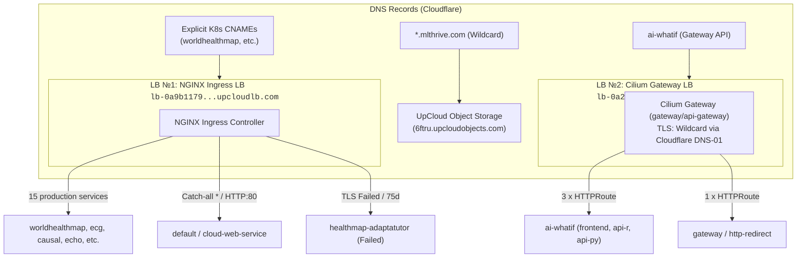

# Kubernetes Infrastructure Audit: Ingress, TLS, and Services

**Audit Date:** September 14, 2026  
**Platform:** UpCloud Managed Kubernetes (UKS)  
**Ingress Entry Points (UpCloud Managed Load Balancers):**  
- **LB №1 (NGINX Ingress):** `lb-0a9b1179d97749e8914609fb8f972856-1.upcloudlb.com` (15 primary services)  
- **LB №2 (Cilium Gateway API):** `lb-0a26cfb0d0f44bcf921ff7ba806f1739-1.upcloudlb.com` (only `ai-whatif` + redirect)  
**Ingress Controllers:** NGINX Ingress Controller + Cilium Gateway API Controller  
**Cluster Legacy Domain:** `*.nightingaleheart.com` (migrated to `mlthrive.com`)

---

## 1. Executive Summary

Analysis of the cluster's network routing and TLS certificates revealed the following key metrics:

| Metric | Value | Status |
| :--- | :--- | :--- |
| **Ingress Entry Points (UpCloud LB)** | **2 independent Load Balancers** | ✅ Both active and programmed |
| **Total Ingress Resources** | 18 | 15 operational + 1 catch-all + 2 stale ACME solvers |
| **Gateway API (Cilium)** | 1 Gateway (`api-gateway`) + 4 HTTPRoute | ✅ Active (HTTP: 1 route, HTTPS: 3 routes) |
| **Total Routed Hosts** | 20 unique hosts + 1 catch-all (`*`) | Active |
| **Total TLS Certificates (Cert-Manager)** | 18 | 16 Ready (True), **2 Not Ready (False)** |
| **ClusterIssuer / Issuer** | `letsencrypt-prod` (Cluster), `gateway/cluster-issuer-api-gateway` | Ready (True) |
| **Critical Incidents** | Stalled certificate issuance in `healthmap-adaptatutor` | ⚠️ Addressed via Ticket #12 |



---

## 2. Critical Issues and Observations

### ⚠️ Issue №1: Certificate Failure in Namespace `healthmap-adaptatutor`
* **Certificates:**
  * `adaptatutor-tls` — **READY: False** (Age: 75 days)
  * `api-adaptatutor-tls` — **READY: False** (Age: 75 days)
* **Stale Temporary Ingresses:**
  * `cm-acme-http-solver-qsffv` (`adaptatutor.nightingaleheart.com`, port 80, age: 45 days)
  * `cm-acme-http-solver-5p4md` (`api-adaptatutor.nightingaleheart.com`, port 80, age: 45 days)
* **Root Cause:** Cert-manager initiated ACME HTTP-01 solver verification 45–75 days prior, but validation failed (DNS conflict, path blockage on `/.well-known/acme-challenge`, or invalid CNAME/A record). Consequently, solver ingress resources remained orphaned in the cluster.
* **Resolution:**
  1. Inspect challenge status: `kubectl -n healthmap-adaptatutor describe challenge`
  2. Verify DNS resolution for `adaptatutor.nightingaleheart.com` and `api-adaptatutor.nightingaleheart.com` to the load balancer IP.
  3. Clean up stale solver-ingress resources and reissue certificates on `mlthrive.com`.

### ℹ️ Issue №2: Default Catch-all Ingress Without SSL Redirect
* **Ingress:** `cloud-ingress` in namespace `default`.
* **Host:** `*` (intercepts all unmatched traffic).
* **Backend:** `cloud-web-service:80` (pods: `192.168.3.91:80`, `192.168.2.193:80`).
* **Annotation:** `nginx.ingress.kubernetes.io/ssl-redirect: false` (listens on HTTP:80 only).
* **Recommendation:** Confirm whether this fallback stub or monitoring endpoint is intended to remain plain HTTP.

---

## 3. Routing Summary Table (Ingress, Hosts, Backends)

| Host / Domain | Namespace | Ingress | TLS | Backend Service(s) | Notes |
| :--- | :--- | :--- | :---: | :--- | :--- |
| `*` (Catch-All) | `default` | `cloud-ingress` | ❌ (80) | `cloud-web-service:80` | Fallback service |
| `adaptatutor.nightingaleheart.com` | `healthmap-adaptatutor` | `healthmap-adaptatutor` | ⚠️ Failed | `healthmap-adaptatutor-frontend` | Certificate status False |
| `adaptatutor.nightingaleheart.com` | `healthmap-adaptatutor` | `cm-acme-http-solver-qsffv` | ❌ (80) | `cm-acme-http-solver-l4dlh` | Stale solver (lingered 45 days) |
| `api-adaptatutor.nightingaleheart.com` | `healthmap-adaptatutor` | `healthmap-adaptatutor` | ⚠️ Failed | `healthmap-adaptatutor-backend` | Certificate status False |
| `api-adaptatutor.nightingaleheart.com` | `healthmap-adaptatutor` | `cm-acme-http-solver-5p4md` | ❌ (80) | `cm-acme-http-solver-85pjg` | Stale solver (lingered 45 days) |
| `aiwhatif.nightingaleheart.com` | `ai-whatif` | `aiwhatif-ingress` | ✅ True | `aiwhatif-frontend-service` | Web UI |
| `healthyheart.nightingaleheart.com` | `ai-whatif` | `aiwhatif-ingress` | ✅ True | `aiwhatif-frontend-service` | Additional UI alias |
| `api.aiwhatif.nightingaleheart.com` | `ai-whatif` | `aiwhatif-ingress` | ✅ True | `aiwhatif-backend-r-service` | R Backend API |
| `api-python.aiwhatif.nightingaleheart.com`| `ai-whatif` | `aiwhatif-ingress` | ✅ True | `aiwhatif-backend-py-service` | Python Backend API |
| `api-cardiomegaly.nightingaleheart.com` | `healthview-cardiomegaly-cnn`| `cardiomegaly-ingress` | ✅ True | `cardiomegaly-backend-service` | ML API |
| `cardiomegaly-cnn.nightingaleheart.com` | `healthview-cardiomegaly-cnn`| `cardiomegaly-ingress` | ✅ True | `cardiomegaly-frontend-service`| Web UI |
| `api-causal-modeling.nightingaleheart.com`| `causal-modeling` | `causal-modeling-ingress` | ✅ True | `causal-modeling-service-backend` | Backend API |
| `causal-modeling.nightingaleheart.com` | `causal-modeling` | `causal-modeling-ingress` | ✅ True | `causal-modeling-service-frontend` | Web UI |
| `api-echoexplore.nightingaleheart.com` | `healthview-echoexplore` | `echoexplore-ingress` | ✅ True | `echoexplore-backend-service` | Backend API |
| `echoexplore.nightingaleheart.com` | `healthview-echoexplore` | `echoexplore-ingress` | ✅ True | `echoexplore-frontend-service` | Web UI |
| `api-echogame.nightingaleheart.com` | `healthview-echogame` | `echogame-ingress` | ✅ True | `echogame-backend-service` | Backend API |
| `echogame.nightingaleheart.com` | `healthview-echogame` | `echogame-ingress` | ✅ True | `echogame-frontend-service` | Web UI |
| `api-harmoniahealth.nightingaleheart.com` | `nightingale-harmoniahealth`| `harmoniahealth-ingress` | ✅ True | `harmoniahealth-node-service` | Node API |
| `harmoniahealth.nightingaleheart.com` | `nightingale-harmoniahealth`| `harmoniahealth-ingress` | ✅ True | `harmoniahealth-frontend-service` | Web UI |
| `api.ecgprediction.nightingaleheart.com` | `ecgprediction` | `ecgprediction-ingress` | ✅ True | `ecgprediction-backend-service` | ML Prediction API |
| `ecgprediction.nightingaleheart.com` | `ecgprediction` | `ecgprediction-ingress` | ✅ True | `ecgprediction-frontend-service` | Web UI |
| `api.pollutionmap.nightingaleheart.com` | `pollutionmap` | `pollutionmap-ingress` | ✅ True | `pollutionmap-service-backend` | Backend API |
| `pollutionmap.nightingaleheart.com` | `pollutionmap` | `pollutionmap-ingress` | ✅ True | `pollutionmap-service-frontend` | Web UI |
| `api.surgicsense.nightingaleheart.com` | `healthview-surgicsense` | `healthview-surgicsense` | ✅ True | `healthview-surgicsense-backend` | Backend API |
| `surgicsense.nightingaleheart.com` | `healthview-surgicsense` | `healthview-surgicsense` | ✅ True | `healthview-surgicsense-frontend` | Web UI |
| `healthmap.nightingaleheart.com` | `healthmap-heart-sayings` | `healthmap-heart-sayings` | ✅ True | `healthmap-heart-sayings` | Web UI & Service |
| `heartaware.nightingaleheart.com` | `nightingale-heartaware` | `heartaware-ingress` | ✅ True | `heartaware-frontend-service` | Web UI |
| `lifesaver.nightingaleheart.com` | `nightingale-lifesaver` | `nightingale-lifesaver` | ✅ True | `nightingale-lifesaver-backend`, `nightingale-lifesaver-frontend` | Combined Ingress |
| `segmentation-api.nightingaleheart.com` | `healthview-segmentation3d` | `healthview-segmentation3d`| ✅ True | `healthview-segmentation3d-backend` | 3D ML API |
| `segmentation.nightingaleheart.com` | `healthview-segmentation3d` | `healthview-segmentation3d`| ✅ True | `healthview-segmentation3d-frontend` | Web UI |
| `worldhealthmap.nightingaleheart.com` | `worldhealthmap` | `worldhealthmap-ingress` | ✅ True | `worldhealthmap-service-frontend` | Web UI |

---

## 4. Cert-Manager and SSL/TLS Certificates State

### Certificate Authorities (Issuers)
* **ClusterIssuer (Global):** `letsencrypt-prod` (Ready: True, Age: 117d)
* **Namespace Issuer:** `gateway/cluster-issuer-api-gateway` (Ready: True, Age: 46d)

### Cluster Certificates Inventory

| Namespace | Certificate Name | Ready | Secret Name | Age | Status |
| :--- | :--- | :---: | :--- | :--- | :---: |
| `ai-whatif` | `aiwhatif-tls` | **True** | `aiwhatif-tls` | 98d | 🟢 Ready |
| `causal-modeling` | `causal-modeling-tls` | **True** | `causal-modeling-tls` | 16d | 🟢 Ready |
| `ecgprediction` | `ecgprediction-tls` | **True** | `ecgprediction-tls` | 104d | 🟢 Ready |
| `gateway` | `wildcard-nightingale-certificate` | **True** | `wildcard-nightingale-certificate` | 44d | 🟢 Ready (Wildcard) |
| `healthmap-adaptatutor` | `adaptatutor-tls` | **False** | `adaptatutor-tls` | 75d | 🔴 **Failed** |
| `healthmap-adaptatutor` | `api-adaptatutor-tls` | **False** | `api-adaptatutor-tls` | 75d | 🔴 **Failed** |
| `healthmap-heart-sayings` | `healthmap-heart-sayings-tls` | **True** | `healthmap-heart-sayings-tls` | 53d | 🟢 Ready |
| `healthview-cardiomegaly-cnn` | `cardiomegaly-tls` | **True** | `cardiomegaly-tls` | 110d | 🟢 Ready |
| `healthview-echoexplore` | `echoexplore-tls` | **True** | `echoexplore-tls` | 94d | 🟢 Ready |
| `healthview-echogame` | `echogame-tls` | **True** | `echogame-tls` | 77d | 🟢 Ready |
| `healthview-segmentation3d` | `healthview-segmentation3d-tls`| **True** | `healthview-segmentation3d-tls` | 47d | 🟢 Ready |
| `healthview-surgicsense` | `surgicsense-tls` | **True** | `surgicsense-tls` | 97d | 🟢 Ready |
| `nightingale-harmoniahealth` | `api-harmoniahealth-tls` | **True** | `api-harmoniahealth-tls` | 68d | 🟢 Ready |
| `nightingale-harmoniahealth` | `harmoniahealth-tls` | **True** | `harmoniahealth-tls` | 68d | 🟢 Ready |
| `nightingale-heartaware` | `heartaware-tls` | **True** | `heartaware-tls` | 109d | 🟢 Ready |
| `nightingale-lifesaver` | `lifesaver-tls` | **True** | `lifesaver-tls` | 105d | 🟢 Ready |
| `pollutionmap` | `pollutionmap-tls` | **True** | `pollutionmap-tls` | 97d | 🟢 Ready |
| `worldhealthmap` | `worldhealthmap-tls` | **True** | `worldhealthmap-tls` | 97d | 🟢 Ready |

---

## 5. Services Grouped by Domain

### Group 1: AI & ML Services
* **AI What-If (`ai-whatif`):**
  * Frontend: `aiwhatif.nightingaleheart.com`, `healthyheart.nightingaleheart.com`
  * R API: `api.aiwhatif.nightingaleheart.com`
  * Python API: `api-python.aiwhatif.nightingaleheart.com`
* **ECG Prediction (`ecgprediction`):**
  * Frontend: `ecgprediction.nightingaleheart.com`
  * API: `api.ecgprediction.nightingaleheart.com`
* **Causal Modeling (`causal-modeling`):**
  * Frontend: `causal-modeling.nightingaleheart.com`
  * API: `api-causal-modeling.nightingaleheart.com`

### Group 2: HealthView Suite (Imaging & Diagnostics)
* **Cardiomegaly CNN:** `cardiomegaly-cnn.nightingaleheart.com` / `api-cardiomegaly.nightingaleheart.com`
* **EchoExplore:** `echoexplore.nightingaleheart.com` / `api-echoexplore.nightingaleheart.com`
* **EchoGame:** `echogame.nightingaleheart.com` / `api-echogame.nightingaleheart.com`
* **3D Segmentation:** `segmentation.nightingaleheart.com` / `segmentation-api.nightingaleheart.com`
* **SurgicSense:** `surgicsense.nightingaleheart.com` / `api.surgicsense.nightingaleheart.com`

### Group 3: Nightingale Ecosystem
* **Harmonia Health:** `harmoniahealth.nightingaleheart.com` / `api-harmoniahealth.nightingaleheart.com`
* **Heart Aware:** `heartaware.nightingaleheart.com`
* **Life Saver:** `lifesaver.nightingaleheart.com`
* **Gateway:** Certificate `wildcard-nightingale-certificate` in namespace `gateway`

### Group 4: Geographic & Population Health Services
* **Pollution Map:** `pollutionmap.nightingaleheart.com` / `api.pollutionmap.nightingaleheart.com`
* **World Health Map:** `worldhealthmap.nightingaleheart.com`
* **Healthmap Heart Sayings:** `healthmap.nightingaleheart.com`
* **Healthmap Adaptatutor:** `adaptatutor.nightingaleheart.com` / `api-adaptatutor.nightingaleheart.com`

---

## 6. Parallel Network Layer: Cilium Gateway API

The audit confirmed the presence of a second active load balancer and Gateway API controller:

### Gateway Details (`gateway/api-gateway`)
* **Controller:** Cilium Service Mesh (`gatewayClassName: cilium`).
* **External Endpoint:** `lb-0a26cfb0d0f44bcf921ff7ba806f1739-1.upcloudlb.com` (dedicated UpCloud Managed Load Balancer).
* **Status:** `Programmed: True`, `Accepted: True`.
* **TLS Termination:** Certificate `wildcard-nightingale-certificate` (`*.nightingaleheart.com`), issued via Cloudflare DNS-01 Issuer `cluster-issuer-api-gateway`.

### Attached HTTPRoutes
1. **Port 80 (HTTP):**
   - 1 attached route: `gateway/http-redirect` (redirect to HTTPS).
2. **Port 443 (HTTPS):**
   - 3 attached routes — **all belonging to `ai-whatif`**:
     * `frontend-aiwhatif-httproute`: host `aiwhatif.nightingaleheart.com`
     * `backendr-aiwhatif-httproute`: host `api.aiwhatif.nightingaleheart.com`
     * `backendpy-httproute`: host `api-python.aiwhatif.nightingaleheart.com`

> [!IMPORTANT]
> **Key Architectural Takeaway:**  
> - **14 of 15 services** (including `worldhealthmap`) route **exclusively through NGINX Ingress (LB №1)**. Their Cloudflare DNS must target `lb-0a9b1179d97749e8914609fb8f972856-1.upcloudlb.com`.
> - **`ai-whatif`** is duplicated across both NGINX Ingress and Cilium Gateway API.

---

## 7. Recommended Action Plan

1. **Pilot Migration on `worldhealthmap`:**
   - Isolated from Cilium Gateway API with `Synced + Healthy` status.
   - Configure explicit CNAME in Cloudflare: `worldhealthmap.mlthrive.com -> lb-0a9b1179d97749e8914609fb8f972856-1.upcloudlb.com` (DNS Only).
   - In Ingress, attach dedicated TLS secret `worldhealthmap-mlthrive-tls`.

2. **Diagnostics and Cleanup for `healthmap-adaptatutor`:**
   ```bash
   kubectl -n healthmap-adaptatutor describe certificate adaptatutor-tls
   kubectl -n healthmap-adaptatutor describe challenge
   kubectl -n healthmap-adaptatutor delete ingress cm-acme-http-solver-qsffv cm-acme-http-solver-5p4md
   ```

3. **Wildcard Strategy for `mlthrive.com`:**
   - Since DNS-01 Issuer via Cloudflare API token (`cluster-issuer-api-gateway`) proved stable, evaluate creating a corresponding Issuer for `*.mlthrive.com` to avoid HTTP-01 solver dependencies where wildcard certificates are advantageous.
