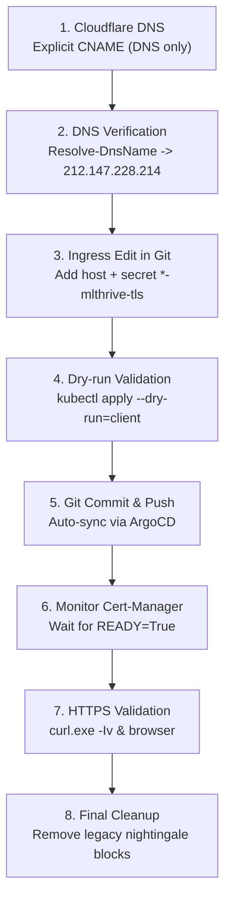

# Service Migration Roadmap to Domain `mlthrive.com`

**Status:** Completed Execution & Audited  
**Last Updated:** September 14, 2026  
**Target Domain:** `*.mlthrive.com`  
**Primary Ingress Load Balancer:** `lb-0a9b1179d97749e8914609fb8f972856-1.upcloudlb.com` (`212.147.228.214`)  
**GitOps Repository:** `git@github.com:curatimeXai/gitops-infra.git` (`master` branch)  

---

## 1. End-to-End Architectural Flow (Proof of Concept)

Each service migration follows an isolated, zero-downtime path:

```text
1. Cloudflare (Explicit CNAME, DNS only)
       ↓
2. UpCloud Managed NGINX Load Balancer (212.147.228.214)
       ↓
3. NGINX Ingress Controller (host: <service>.mlthrive.com)
       ↓
4. Cert-Manager (HTTP-01 Solver: /.well-known/acme-challenge)
       ↓
5. Let's Encrypt CA (Issue new secret: <service>-mlthrive-tls)
       ↓
6. Kubernetes ClusterIP Service:80
       ↓
7. Backend / Frontend Pod (Running)
```

> [!IMPORTANT]
> **Golden Rule of TLS Isolation:**  
> The legacy host `nightingaleheart.com` (NXDOMAIN) and the new `mlthrive.com` **must never be combined into a single TLS secret**.  
> Each service uses a dedicated `<service>-mlthrive-tls` secret, guaranteeing 100% independent certificate issuance insulated from legacy domain failures.

---

## 2. Standard Operating Procedure (SOP per Service)

Each service migration executes across 8 standardized steps:



### Detailed SOP Steps:

1. **DNS (Cloudflare Dashboard):**
   * `Type`: `CNAME`
   * `Name`: `<service-subdomain>`
   * `Target`: `lb-0a9b1179d97749e8914609fb8f972856-1.upcloudlb.com`
   * `Proxy status`: `DNS only` (gray cloud)

2. **Verify DNS Resolution:**
   ```powershell
   Resolve-DnsName <service>.mlthrive.com
   # Expected IP: 212.147.228.214 (NGINX LB), NOT Object Storage!
   ```

3. **Modify Ingress Manifest in `gitops-infra` (`apps/<app>/ingress.yaml`):**
   * Add the new host to `spec.tls` with a dedicated `secretName: <service>-mlthrive-tls`.
   * Add the new rule to `spec.rules` for host `<service>.mlthrive.com`.

4. **Local Pre-Commit Validation:**
   ```powershell
   git diff --check
   kubectl apply --dry-run=client -f .\apps\<app>\ingress.yaml
   git status --short
   ```

5. **Commit & Push via GitOps:**
   ```powershell
   git add apps/<app>/ingress.yaml
   git commit -m "Add mlthrive domain for <service>"
   git push origin master
   ```

6. **Monitor in ArgoCD & Cert-Manager:**
   ```powershell
   # Check application sync status
   kubectl -n argocd get application <app-name> -w
   
   # Check certificate issuance status
   kubectl -n <namespace> get certificate -w
   kubectl -n <namespace> describe certificate <service>-mlthrive-tls
   ```

7. **Verify Over HTTPS:**
   ```powershell
   curl.exe -Iv https://<service>.mlthrive.com/
   ```

8. **Cleanup:**
   Once verified, remove legacy `nightingaleheart.com` blocks from `ingress.yaml` in a follow-up commit.

---

## 3. Phase 0: Reference Pilot Runbook (`worldhealthmap`)

The entire procedure was validated on `worldhealthmap`.

### Step 1. Cloudflare DNS CNAME Creation
In Cloudflare DNS management for `mlthrive.com`:
* **Type:** `CNAME`
* **Name:** `worldhealthmap`
* **Target:** `lb-0a9b1179d97749e8914609fb8f972856-1.upcloudlb.com`
* **Proxy status:** `DNS only`
* **TTL:** Auto

#### DNS Verification Command:
```powershell
Resolve-DnsName worldhealthmap.mlthrive.com
```

#### Terminal Output:
```text
Name                           Type   TTL   Section    NameHost
----                           ----   ---   -------    --------
worldhealthmap.mlthrive.com    CNAME  300   Answer     lb-0a9b1179d97749e8914609fb8f972856-1.upcloudlb.com

Name       : lb-0a9b1179d97749e8914609fb8f972856-1.upcloudlb.com
QueryType  : A
TTL        : 180
Section    : Answer
IP4Address : 212.147.228.214
```
> **Verification Goal:** Domain points directly to the NGINX Load Balancer IP (`212.147.228.214`), not UpCloud Object Storage.

---

### Step 2. Ingress Manifest Modification in Git
In `gitops-infra`, open [apps/healthmap-worldhealthmap/ingress.yaml](file:///d:/Projects/Upcloud/gitops-infra/apps/healthmap-worldhealthmap/ingress.yaml).

Add `worldhealthmap.mlthrive.com` alongside the legacy host with a **dedicated secret** `worldhealthmap-mlthrive-tls`:

```yaml
apiVersion: networking.k8s.io/v1
kind: Ingress
metadata:
  name: worldhealthmap-ingress
  namespace: worldhealthmap
  annotations:
    cert-manager.io/cluster-issuer: letsencrypt-prod
spec:
  ingressClassName: nginx

  tls:
    - hosts:
        - worldhealthmap.nightingaleheart.com
      secretName: worldhealthmap-tls

    - hosts:
        - worldhealthmap.mlthrive.com
      secretName: worldhealthmap-mlthrive-tls

  rules:
    - host: worldhealthmap.nightingaleheart.com
      http:
        paths:
          - path: /
            pathType: Prefix
            backend:
              service:
                name: worldhealthmap-service-frontend
                port:
                  number: 80

    - host: worldhealthmap.mlthrive.com
      http:
        paths:
          - path: /
            pathType: Prefix
            backend:
              service:
                name: worldhealthmap-service-frontend
                port:
                  number: 80
```

---

### Step 3. Local Validation & Commit
Validate syntax and inspect diff prior to pushing:

```powershell
cd D:\Projects\Upcloud\gitops-infra

# 1. Check for trailing whitespace
git diff --check

# 2. Inspect diff
git diff -- apps/healthmap-worldhealthmap/ingress.yaml

# 3. Validate client-side dry-run
kubectl apply --dry-run=client -f .\apps\healthmap-worldhealthmap\ingress.yaml

# 4. Confirm modified status
git status --short

# 5. Commit and push to master
git add apps/healthmap-worldhealthmap/ingress.yaml
git commit -m "Add mlthrive domain for worldhealthmap"
git push origin master
```

---

### Step 4. Observe ArgoCD Delivery
After push, ArgoCD reconciles the change:

```powershell
kubectl -n argocd get application healthmap-worldhealthmap -w
```

#### Terminal Output:
```text
NAME                       SYNC STATUS   HEALTH STATUS
healthmap-worldhealthmap   Synced        Healthy
healthmap-worldhealthmap   OutOfSync     Healthy
healthmap-worldhealthmap   Synced        Healthy
```
> **Verification Goal:** Returns cleanly to `Synced / Healthy`.

---

### Step 5. Verify Ingress in Cluster
Confirm that the NGINX Ingress Controller picked up both hosts:

```powershell
kubectl -n worldhealthmap get ingress worldhealthmap-ingress
```

#### Terminal Output:
```text
NAME                     CLASS   HOSTS                                                             ADDRESS                                               PORTS     AGE
worldhealthmap-ingress   nginx   worldhealthmap.nightingaleheart.com,worldhealthmap.mlthrive.com   lb-0a9b1179d97749e8914609fb8f972856-1.upcloudlb.com   80, 443   109d
```

---

### Step 6. Monitor TLS Issuance (Cert-Manager)
Check the `Certificate` resource and ACME HTTP-01 progress:

```powershell
kubectl -n worldhealthmap get certificate
kubectl -n worldhealthmap get order,challenge
```

#### Terminal Output:
```text
NAME                          READY   SECRET                        AGE
worldhealthmap-mlthrive-tls   True    worldhealthmap-mlthrive-tls   4m47s
worldhealthmap-tls            True    worldhealthmap-tls            97d

NAME                                                                  STATE   AGE
order.acme.cert-manager.io/worldhealthmap-mlthrive-tls-1-3663941283   valid   4m57s
```
> **Verification Goal:** `READY` equals **`True`** for `worldhealthmap-mlthrive-tls`, and order state is **`valid`**.

---

### Step 7. Verify Endpoint Over HTTPS
Send a curl request to verify headers:

```powershell
curl.exe -Iv https://worldhealthmap.mlthrive.com/
```

#### Terminal Output:
```text
* Host worldhealthmap.mlthrive.com:443 was resolved.
* IPv4: 212.147.228.214
*   Trying 212.147.228.214:443...
* ALPN: server accepted http/1.1
* Established connection to worldhealthmap.mlthrive.com (212.147.228.214 port 443)
* using HTTP/1.x
> HEAD / HTTP/1.1
> Host: worldhealthmap.mlthrive.com
> User-Agent: curl/8.21.0
> Accept: */*
>
< HTTP/1.1 200 OK
HTTP/1.1 200 OK
< Date: Mon, 14 Sep 2026 10:56:44 GMT
< Content-Type: text/html
< Content-Length: 595
< Connection: keep-alive
< Last-Modified: Mon, 20 Jul 2026 13:38:03 GMT
< Strict-Transport-Security: max-age=31536000; includeSubDomains
```
> **Verification Goal:**  
> - Connection IP: `212.147.228.214`  
> - HTTP Status: **`HTTP/1.1 200 OK`**  
> - Security header: `Strict-Transport-Security` present.  
> - Valid TLS padlock in browser without security warnings.

---

### Step 8. Post-Migration Cleanup
Remove legacy `nightingaleheart.com` sections from `ingress.yaml`:

```yaml
apiVersion: networking.k8s.io/v1
kind: Ingress
metadata:
  name: worldhealthmap-ingress
  namespace: worldhealthmap
  annotations:
    cert-manager.io/cluster-issuer: letsencrypt-prod
spec:
  ingressClassName: nginx
  tls:
    - hosts:
        - worldhealthmap.mlthrive.com
      secretName: worldhealthmap-mlthrive-tls
  rules:
    - host: worldhealthmap.mlthrive.com
      http:
        paths:
          - path: /
            pathType: Prefix
            backend:
              service:
                name: worldhealthmap-service-frontend
                port:
                  number: 80
```
Commit and push to `master`:
```powershell
git commit -am "Cleanup old nightingale domain for worldhealthmap"
git push origin master
```
Remove unneeded legacy secret and certificate:
```powershell
kubectl -n worldhealthmap delete certificate worldhealthmap-tls
kubectl -n worldhealthmap delete secret worldhealthmap-tls
```

---

## 4. Migration Waves Schedule

Following the `worldhealthmap` pilot, services were rolled out in structured waves:

### 🌊 Wave 1: Simple Single-Host UI Services
*Low complexity frontends with direct ClusterIP backends.*

| Service | Namespace | Manifest Path | Target Host | Status |
| :--- | :--- | :--- | :--- | :---: |
| **World Health Map** | `worldhealthmap` | `apps/healthmap-worldhealthmap/ingress.yaml` | `worldhealthmap.mlthrive.com` | 🟢 Complete |
| **Healthmap Heart Sayings** | `healthmap-heart-sayings` | `apps/healthmap-heart-sayings/ingress.yaml` | `healthmap.mlthrive.com` | 🟢 Complete |
| **Heart Aware** | `nightingale-heartaware` | `apps/nightingale-heartaware/ingress.yaml` | `heartaware.mlthrive.com` | 🟡 Ticket #7 |
| **Life Saver** | `nightingale-lifesaver` | `apps/nightingale-lifesaver/ingress.yaml` | `lifesaver.mlthrive.com` | 🟢 Complete |

---

### 🌊 Wave 2: Dual-Component Services (Frontend + Backend API)
*Required dual CNAMEs (UI + API) and dual routing rules.*

| Service | Namespace | Manifest Path | Target Hosts | Status |
| :--- | :--- | :--- | :--- | :---: |
| **Causal Modeling** | `causal-modeling` | `apps/causal-modeling/ingress.yaml` | `causal-modeling.mlthrive.com`<br/>`api-causal-modeling.mlthrive.com` | 🟡 Ticket #1 |
| **ECG Prediction** | `ecgprediction` | `apps/healthview-ecgprediction/ingress.yaml` | `ecgprediction.mlthrive.com`<br/>`api.ecgprediction.mlthrive.com` | 🟢 Complete |
| **Pollution Map** | `pollutionmap` | `apps/healthmap-pollutionmap/ingress.yaml` | `pollutionmap.mlthrive.com`<br/>`api.pollutionmap.mlthrive.com` | 🟡 Ticket #2 |
| **Cardiomegaly CNN** | `healthview-cardiomegaly-cnn` | `apps/healthview-cardiomegaly-cnn/ingress.yaml` | `cardiomegaly-cnn.mlthrive.com`<br/>`api-cardiomegaly.mlthrive.com` | 🟡 Ticket #7 |
| **EchoExplore** | `healthview-echoexplore` | `apps/healthview-echoexplore/ingress.yaml` | `echoexplore.mlthrive.com`<br/>`api-echoexplore.mlthrive.com` | 🟢 Complete |
| **Harmonia Health** | `nightingale-harmoniahealth` | `apps/nightingale-harmoniahealth/ingress.yaml` | `harmoniahealth.mlthrive.com`<br/>`api-harmoniahealth.mlthrive.com` | 🟡 Ticket #5 |

---

### 🌊 Wave 3: Services with Embedded Environment Variables
*Required coordinated updates to Ingress, ConfigMaps, and Deployments.*

| Service | Namespace | Configuration Sources | Action Taken |
| :--- | :--- | :--- | :--- |
| **SurgicSense** | `healthview-surgicsense` | `ingress.yaml`<br/>`configmap.yaml` | Updated Ingress + `RESET_PASSWORD_URL: https://surgicsense.mlthrive.com/reset-password` (Blocked on Ticket #6 & #7) |
| **3D Segmentation** | `healthview-segmentation3d` | `ingress.yaml`<br/>`frontend-configmap.yaml` | Updated Ingress + `API_BASE_URL: https://segmentation-api.mlthrive.com` (Blocked on Ticket #9 & #11) |
| **EchoGame** | `healthview-echogame` | `ingress.yaml`<br/>`deployment-frontend.yaml`<br/>`deployment-backend.yaml` | Updated Ingress + env (Blocked on Ticket #3 & #8) |

---

### 🌊 Wave 4: Complex & Platform-Blocked Services

1. **`healthmap-adaptatutor`:**
   - **Infrastructure:** Ingress and TLS cut over cleanly to `adaptatutor.mlthrive.com` (Frontend `200 OK`).
   - **Backend Migration:** Production secret contains placeholder strings (`CHANGE_ME`) and backend pod has 0 ready replicas (Tracked in Ticket #12).

2. **`ai-whatif`:**
   - **Routing Architecture:** Dual-routed through NGINX Ingress and Cilium Gateway API (Load Balancer №2: `212.147.228.215`).
   - **Status:** Deferred pending resolution of cluster-level Cilium operator / Gateway API issue (Ticket #11).

---

### 🌊 Wave 5: Infrastructure Cleanup & Audit
1. **Contact Email Updates:**
   - Update `info@nightingaleheart.com` in `apps/cluster-issuer/*.yaml` to the active domain contact address.
2. **Cilium Gateway Strategy:**
   - Resolve Gateway API CRD version mismatch with UpCloud Support (Ticket #11) before migrating or retiring LB №2.
3. **Cluster Secret Pruning:**
   - Delete orphaned `*-tls` secrets in namespaces after validating traffic on `mlthrive.com`.
