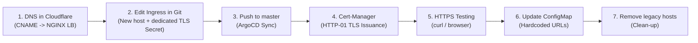

# Service Migration Strategy & Implementation Plan (`mlthrive.com`)

**Approval Date:** September 14, 2026  
**Context:** Migrating production Kubernetes services from the expired legacy domain `*.nightingaleheart.com` (NXDOMAIN) to the production domain `*.mlthrive.com`.  
**Root Domain Status:** `https://mlthrive.com/` is actively hosted on UpCloud Managed Object Storage.

---

## 1. Architectural Constraints & Critical Discoveries

### ⚠️ Constraint №1: DNS Collision on `_acme-challenge.mlthrive.com` (RFC 1034)
* **Cloudflare State:**  
  The root domain `mlthrive.com` already utilizes:
  ```text
  _acme-challenge.mlthrive.com  CNAME  <endpoint-upcloud-storage>
  ```
  This record is required by UpCloud Object Storage to automatically issue and renew the root website's SSL/TLS certificate.
* **Risk & Collision:**  
  Attempting to issue a wildcard certificate `*.mlthrive.com` via Cert-Manager DNS-01 (Cloudflare) causes cert-manager to attempt creating:
  ```text
  _acme-challenge.mlthrive.com  TXT  <challenge-token>
  ```
  Under **RFC 1034 and RFC 2181**, a `CNAME` record **cannot coexist** with any other record type (including `TXT`) at the same FQDN.
* **Consequence:**  
  Issuing `*.mlthrive.com` via DNS-01 would either fail at the Cloudflare API layer or overwrite the existing CNAME, **breaking TLS for the main website on Object Storage**.
* **Architectural Solution:**  
  Migrate all Kubernetes services **via NGINX Ingress using HTTP-01 validation** (`letsencrypt-prod`). This approach completely avoids touching `_acme-challenge` DNS records in Cloudflare.

---

### ⚠️ Constraint №2: Wildcard Certificate Scope Limitation (RFC 6125) for Multi-Level Subdomains
* **Legacy Cilium Gateway Behavior:**  
  The certificate `wildcard-nightingale-certificate` covered only `*.nightingaleheart.com`.
* **RFC 6125 Standard Limitation:**  
  The wildcard character `*` matches strictly **one** DNS label:
  * `aiwhatif.nightingaleheart.com` — ✅ Valid (1 label).
  * `api.aiwhatif.nightingaleheart.com` — ❌ **Invalid** (2 labels, browser reports `ERR_CERT_COMMON_NAME_INVALID`).
  * `api-python.aiwhatif.nightingaleheart.com` — ❌ **Invalid** (2 labels).
* **Consequence:**  
  The only fully functional path for multi-level API endpoints was **NGINX Ingress**, where certificates were issued via HTTP-01 explicitly listing each SAN.
* **Solution:**  
  For services with multi-level APIs, issue certificates with explicit host lists through NGINX Ingress or provision dedicated subdomain wildcards (`*.aiwhatif.mlthrive.com`).

---

### ⚠️ Constraint №3: Cloudflare Wildcard Points to Object Storage
* Cloudflare currently resolves:  
  `*.mlthrive.com` → `6ftru.upcloudobjects.com` (UpCloud Object Storage).
* Any Kubernetes subdomain without an explicit record will be routed to Object Storage and return HTTP 404.
* **Solution:**  
  Every Kubernetes service must have an **explicit CNAME record** targeting the NGINX Load Balancer:
  ```text
  <service>.mlthrive.com  CNAME  lb-0a9b1179d97749e8914609fb8f972856-1.upcloudlb.com  (DNS only)
  ```

---

## 2. Diagnosis and Resolution of `ai-whatif` ArgoCD Failure

The audit identified the cause of `ai-whatif`'s **OutOfSync / Degraded** status:

1. **Diagnosis:**  
   The only out-of-sync resource was `HTTPRoute/backendr-aiwhatif-httproute`. All pods, deployments, and Ingresses were `Synced`.
2. **Root Cause:**  
   An indentation error existed in `apps/ai-whatif/backendR-httpRoute.yaml`:
   ```yaml
   # DEFECTIVE SYNTAX:
     rules:
     - matches:
       - path:
         type: PathPrefix
         value: /
   ```
   Because `type` and `value` were placed at the same indentation level as `path:`, YAML parsed the node as `{"path": null, "type": "PathPrefix", "value": "/"}`. The Cilium controller rejected the invalid route.
3. **Remediation:**  
   Correct the indentation:
   ```yaml
   # CORRECTED SYNTAX:
     rules:
     - matches:
       - path:
           type: PathPrefix
           value: /
   ```

---

## 3. Safe Migration Workflow (per Service)

Each service migrates **individually** without mass search-and-replace scripts, adhering to a 7-step lifecycle:



### Safe Ingress Configuration Pattern (Dual Host + Isolated Secrets):
```yaml
apiVersion: networking.k8s.io/v1
kind: Ingress
metadata:
  name: <service>-ingress
  namespace: <service>
  annotations:
    cert-manager.io/cluster-issuer: letsencrypt-prod
spec:
  ingressClassName: nginx
  tls:
    # Legacy block (preserved until cutover verification completes)
    - hosts:
        - <service>.nightingaleheart.com
      secretName: <service>-tls
    # New isolated block for target domain
    - hosts:
        - <service>.mlthrive.com
      secretName: <service>-mlthrive-tls
  rules:
    - host: <service>.nightingaleheart.com
      http:
        paths:
          - path: /
            pathType: Prefix
            backend:
              service:
                name: <service-backend>
                port:
                  number: 80
    # New rule for mlthrive
    - host: <service>.mlthrive.com
      http:
        paths:
          - path: /
            pathType: Prefix
            backend:
              service:
                name: <service-backend>
                port:
                  number: 80
```

---

## 4. Pilot Execution: `worldhealthmap`

`worldhealthmap` served as **Pilot №1**:
* ArgoCD status: **Synced + Healthy**;
* Architecture: Pure SPA frontend without complex inter-service database dependencies;
* Operates exclusively via NGINX Ingress (isolated from Cilium Gateway API).

### Pilot Verification Checklist:

- [x] **Step 1. DNS (Cloudflare):**
  * Create `worldhealthmap.mlthrive.com` CNAME `lb-0a9b1179d97749e8914609fb8f972856-1.upcloudlb.com` (DNS only).
- [x] **Step 2. Git (`apps/healthmap-worldhealthmap/ingress.yaml`):**
  * Add host `worldhealthmap.mlthrive.com` and secret `worldhealthmap-mlthrive-tls`.
- [x] **Step 3. Git Push & ArgoCD:**
  * Commit and push to `master`. Reconcile in ArgoCD.
- [x] **Step 4. Certificate Validation:**
  ```powershell
  kubectl -n worldhealthmap get certificate,ingress
  ```
- [x] **Step 5. Endpoint Validation:**
  ```powershell
  curl.exe -Iv https://worldhealthmap.mlthrive.com
  ```

---

## 5. Migration Waves Overview

| Wave | Services | Complexity | Key Requirements |
| :---: | :--- | :---: | :--- |
| **Wave 1 (Simple UI)** | `worldhealthmap`, `healthmap-heart-sayings`, `heartaware` | Low | Single hosts, static/SPA frontends |
| **Wave 2 (Frontend + Backend)** | `causal-modeling`, `ecgprediction`, `pollutionmap`, `cardiomegaly-cnn`, `echoexplore`, `harmoniahealth` | Medium | Dual hosts (UI + API), HTTP-01 certificates |
| **Wave 3 (ConfigMap / ENV Dependencies)**| `healthview-surgicsense`, `healthview-segmentation3d`, `healthview-echogame` | Medium-High | Requires synchronized updates to ConfigMap/Deployments |
| **Wave 4 (Complex Services)** | `ai-whatif`, `healthmap-adaptatutor` | High | Gateway API resolution for `ai-whatif`; legacy backend recovery for `adaptatutor` |
| **Wave 5 (Infrastructure)** | `cilium-apiGateway`, `cluster-issuer` | Medium | Contact email updates and Gateway API support alignment |
