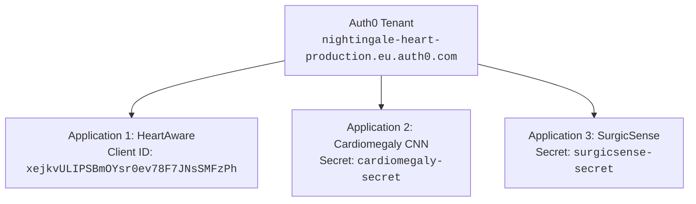

# Pending Actions Registry: Auth0 Configuration and External Dependencies

**Created:** September 14, 2026  
**Status:** ⏸️ **Pending** — Awaiting Auth0 administrative credentials  
**Auth0 Tenant:** `nightingale-heart-production.eu.auth0.com`  

---

## 1. Current Blocker

During the migration of `heartaware` to `mlthrive.com`, authentication was identified as being tightly coupled to the external Identity Provider (IdP) **Auth0**.  
To finalize user login flows, the new `mlthrive.com` callback and logout URLs must be authorized in the Auth0 management dashboard. Currently, administrative credentials for `nightingale-heart-production.eu.auth0.com` are unavailable to the infrastructure migration team.

> [!WARNING]
> **Why Kubernetes Secrets Must Not Be Updated Prematurely:**  
> If `APP_BASE_URL` in `heartaware-secrets` is changed prior to adding the new URLs in the Auth0 console, the application will redirect users to Auth0 with `redirect_uri=https://heartaware.mlthrive.com/auth/callback`.  
> Because Auth0 does not recognize this new origin, it will immediately reject login attempts with a fatal `403 / Callback URL mismatch` error.  
> **The secret in K8s has intentionally been left unmodified.**

---

## 2. Current Cluster State for Migrated Services

At the network and infrastructure layer, services are completely ready:

| Service | DNS (Cloudflare) | Ingress (NGINX) | TLS (Cert-Manager) | Application Status |
| :--- | :---: | :---: | :---: | :---: |
| **`worldhealthmap`** | ✅ Ready (`212.147.228.214`) | ✅ Synced | ✅ `READY: True` | 🟢 **Operational (200 OK)** |
| **`heartaware`** | ✅ Ready (`212.147.228.214`) | ✅ Synced | ✅ `READY: True` (issued in 45s) | 🟡 **Network layer operational (307 Redirect to Auth0)**; login awaits Auth0 tenant configuration |

---

## 3. Inventory of Auth0-Dependent Services

An audit of all Kubernetes secrets across the cluster identified **3 services** bound to tenant `nightingale-heart-production.eu.auth0.com`:



### 1. Service: `nightingale-heartaware`
* **Namespace:** `nightingale-heartaware`
* **K8s Secret:** `heartaware-secrets` (unmanaged by ArgoCD, manual secret)
* **Auth0 Client ID:** `xejkvULIPSBmOYsr0ev78F7JNsSMFzPh`
* **Secret Keys Requiring Update:**
  * `APP_BASE_URL`: Currently `https://heartaware.nightingaleheart.com` → target `https://heartaware.mlthrive.com`
* **Status:** Ingress and TLS ready on new domain.

### 2. Service: `healthview-cardiomegaly-cnn`
* **Namespace:** `healthview-cardiomegaly-cnn`
* **K8s Secret:** `cardiomegaly-secret`
* **Secret Keys Requiring Update:**
  * `VITE_AUTH0_REDIRECT_URI`: Contains legacy redirect URL to `cardiomegaly-cnn.nightingaleheart.com`
  * `VITE_AUTH0_CLIENT_ID`
  * `VITE_AUTH0_DOMAIN`: `nightingale-heart-production.eu.auth0.com`
* **Status:** Ingress updated in Git.

### 3. Service: `healthview-surgicsense`
* **Namespace:** `healthview-surgicsense`
* **K8s Secret:** `surgicsense-secret`
* **Secret Keys Requiring Update:**
  * `VITE_AUTH0_REDIRECT_URI`: Contains legacy redirect URL to `surgicsense.nightingaleheart.com`
  * `VITE_AUTH0_DOMAIN`: `nightingale-heart-production.eu.auth0.com`
* **Status:** Ingress updated in Git.

---

## 4. Execution Checklist (Post-Auth0 Access)

Once administrative access to Auth0 is obtained, execute the following steps:

### Step 1. Auth0 Dashboard Configuration
Log into [https://manage.auth0.com/](https://manage.auth0.com/) under tenant `nightingale-heart-production.eu.auth0.com`:

#### 1. For HeartAware (`xejkvULIPSBmOYsr0ev78F7JNsSMFzPh`):
* **Allowed Callback URLs:**  
  Add: `https://heartaware.mlthrive.com/auth/callback`
* **Allowed Logout URLs:**  
  Add: `https://heartaware.mlthrive.com`
* **Allowed Web Origins:**  
  Add: `https://heartaware.mlthrive.com`
* Click **Save Changes**.

#### 2. For Cardiomegaly CNN:
* In the corresponding application settings, add to Allowed Callback, Logout, and Web Origins:
  `https://cardiomegaly-cnn.mlthrive.com` and its callback URI.

#### 3. For SurgicSense:
* In the corresponding application settings, add:
  `https://surgicsense.mlthrive.com` and its callback URI.

---

### Step 2. Kubernetes Secret Patching

After updating Auth0, execute the following commands in PowerShell:

```powershell
# --- 1. HeartAware ---
$heartawareUrlB64 = [Convert]::ToBase64String([Text.Encoding]::UTF8.GetBytes("https://heartaware.mlthrive.com"))

kubectl -n nightingale-heartaware patch secret heartaware-secrets `
  --type='json' `
  -p="[{'op': 'replace', 'path': '/data/APP_BASE_URL', 'value': '$heartawareUrlB64'}]"

kubectl -n nightingale-heartaware rollout restart deployment heartaware-frontend
kubectl -n nightingale-heartaware rollout status deployment heartaware-frontend
```

---

### Step 3. Verification of Authentication Flow

1. Header verification via curl (`redirect_uri` parameter):
   ```powershell
   curl.exe -s -D - -o NUL https://heartaware.mlthrive.com/auth/login | Select-String -Pattern "redirect_uri"
   ```
   *Expected:* `redirect_uri=https%3A%2F%2Fheartaware.mlthrive.com%2Fauth%2Fcallback`.

2. Browser verification:
   * Navigate to `https://heartaware.mlthrive.com/`.
   * Click "Login" → confirm redirect to Auth0 login interface.
   * Authenticate with test user → confirm redirect back to `https://heartaware.mlthrive.com/dashboard` without errors.

---

## 5. Non-Auth0 Services Ready for Immediate Cutover

Services that do **NOT** depend on Auth0 and can proceed independently:

1. **`healthmap.mlthrive.com` (`healthmap-heart-sayings`)** — UI / service.
2. **`lifesaver.mlthrive.com` (`nightingale-lifesaver`)** — Chatbot frontend & backend.
3. **`causal-modeling.mlthrive.com`** & **`api-causal-modeling.mlthrive.com`**.
4. **`ecgprediction.mlthrive.com`** & **`api.ecgprediction.mlthrive.com`**.
5. **`pollutionmap.mlthrive.com`** & **`api.pollutionmap.mlthrive.com`**.
6. **`echoexplore.mlthrive.com`** & **`api-echoexplore.mlthrive.com`**.
